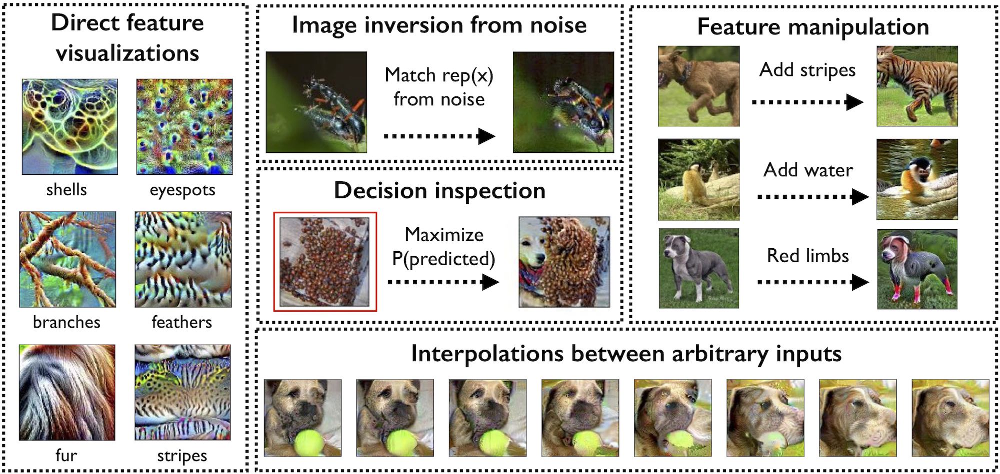

# Code for "Adversarial Robustness as a Prior on Learned Representations"

## Running the notebooks

Steps to run the notebooks (for now, requires CUDA):
- Clone this repository with `--recurse-submodules` to include submodules (`--recursive` pre-Git 2.13)
- Download our models: [CIFAR-10](TODO), [Restricted ImageNet](TODO)
- Make a `models` folder in the main repository folder, and save the
  checkpoints there
- Install all the required packages with `pip install -r requirements.txt`
- Edit `user_constants.py` to point to PyTorch-formatted versions of the `CIFAR` and `ImageNet` datasets
- Start a jupyter notebook server: `jupyter notebook . --ip 0.0.0.0`

